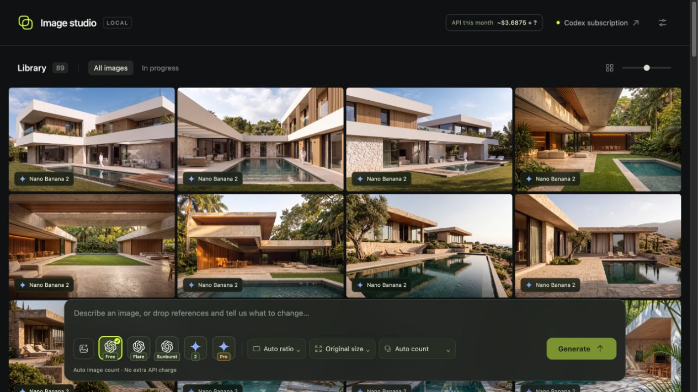
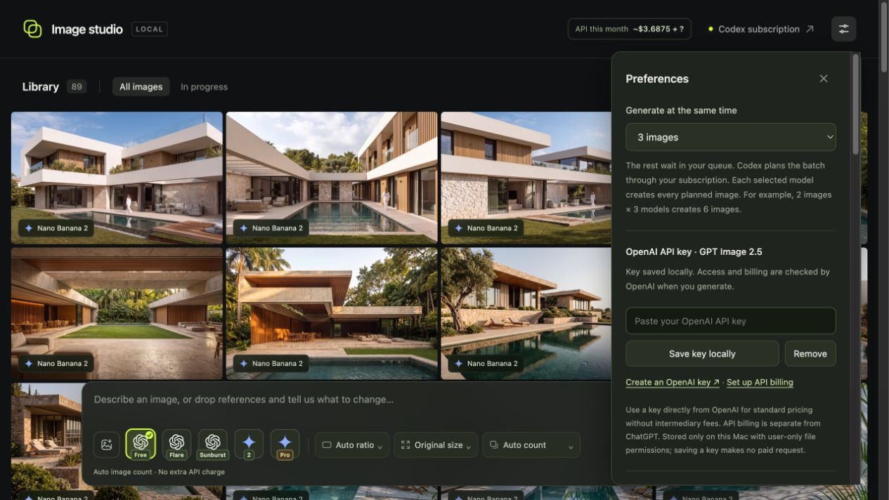
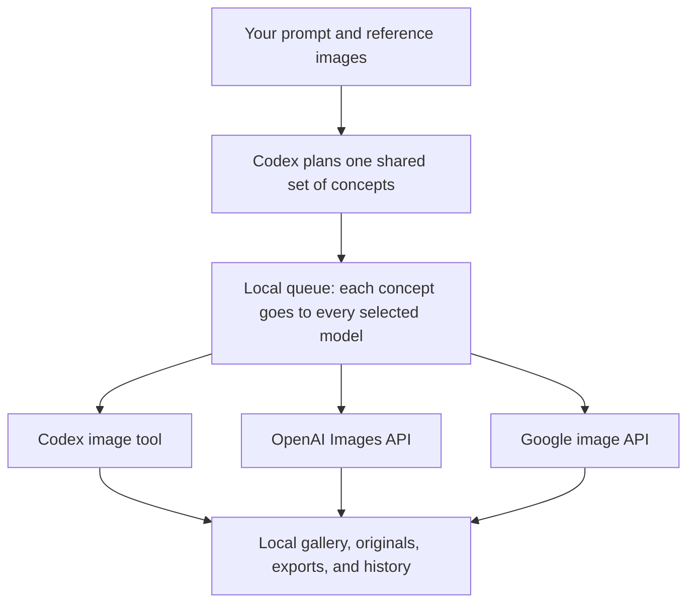
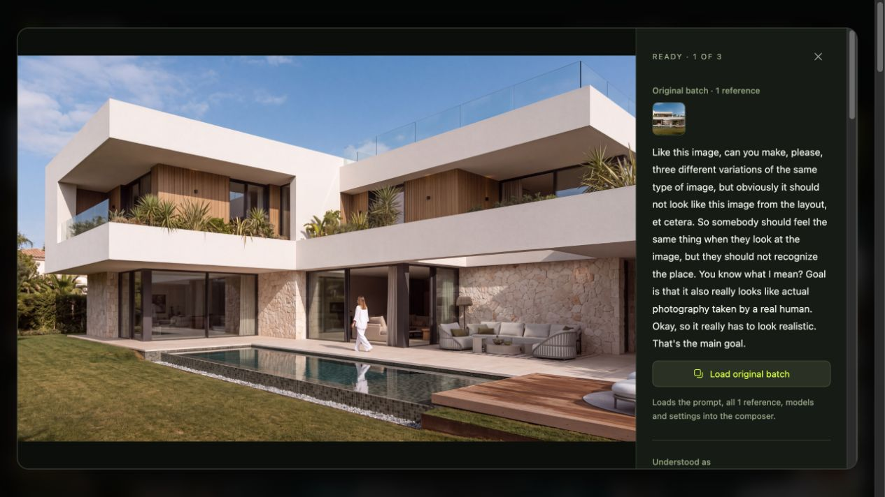

<div align="center">
  
  <h1>Image Studio</h1>
  <p><strong>One brief. Multiple image models. Your own workspace.</strong></p>
  <p>Generate, edit, and compare AI images with your own accounts and API keys.</p>

  <a href="https://github.com/koppkvn/image-gen-open-source/actions/workflows/ci.yml"></a>
  <a href="https://nodejs.org"></a>
  <a href="LICENSE"></a>

  <p><a href="#quick-start">Quick start</a> · <a href="#how-it-works">How it works</a> · <a href="#models-and-controls">Models</a> · <a href="docs/USAGE.md">Full guide</a> · <a href="CONTRIBUTING.md">Contributing</a></p>
</div>



*Image Studio in everyday use: generated architectural variations, model labels, and a floating composer for the next idea.*

Image Studio brings your prompt, references, model settings, queue, and image library into one local browser app. Use it to explore a visual direction, make variations from a reference, or compare how different models interpret the same brief.

## What you can do

| | |
| --- | --- |
| **Compare models** | Send the same planned concepts and references to multiple image models, then compare matching results in one gallery. |
| **Work from references** | Drop or paste images, reuse a generated image, and tell the planner what should stay and what should change. |
| **Generate batches** | Create up to 20 concepts per model. Set 1–4 concurrent jobs; the rest wait in the queue. |
| **Refine one image** | Retry an individual attempt, edit its request, or load an entire previous batch into the composer. |
| **Control the output** | Choose aspect ratio and export size, with provider-specific quality, background, and thinking controls. |
| **Keep context** | Inspect the brief, references, original output, export dimensions, and recorded usage for each image. |

No frontend build step. No shared API account. Your library lives on your computer.

## Quick start

### 1. Install and run

You need **Node.js 22 or newer** and npm. You also need a **ChatGPT account with Codex access** for batch planning.

```sh
git clone https://github.com/koppkvn/image-gen-open-source.git
cd image-gen-open-source
npm ci
npm start
```

Open **[localhost:4317](http://localhost:4317)**.

On macOS, you can also double-click **Start Image Studio.command** after downloading the project. The launcher installs missing dependencies, starts the server, and opens the browser. On Linux, use the terminal commands above; on Windows, use them inside WSL.

### 2. Connect Codex

Click **Connect Codex** and sign in with your own ChatGPT account. A compatible Codex CLI is bundled and pinned in the project, so you do not need to install it globally. An existing local Codex sign-in can be reused.

> **Every new batch uses Codex to plan the images**, including batches rendered with paid OpenAI or Google APIs. An image API key by itself is not enough to run this version of the app.

### 3. Add the image providers you want

Open **Preferences** with the settings icon in the top-right corner.

| Route | What to connect |
| --- | --- |
| Codex image tool | Your Codex/ChatGPT connection; no separate image API key. |
| OpenAI image models | Your own [OpenAI API key](https://platform.openai.com/api-keys), saved under **OpenAI API key**. |
| Google image models | Your own [Google AI Studio key](https://aistudio.google.com/api-keys), saved under **Google AI Studio API key**. |

Only configure providers you want to use. Paste keys into the app, then click **Save key locally**. Saving a key does not generate an image or verify access to a particular model.

<details>
<summary><strong>See Preferences and key setup</strong></summary>



Google's key form is below the OpenAI form in the same panel. A saved key is shown only as a status; its value is never displayed.

</details>

The app reads image-provider keys from Preferences, **not from `.env` files or API-key environment variables**. Paid API requests use your provider billing; they are separate from your ChatGPT subscription allowance. Model availability depends on your account.

### 4. Make something

1. Write a brief and optionally add reference images.
2. Select one or more model tiles.
3. Choose images per model, aspect ratio, and any output controls.
4. Press **Generate** or **Compare**.

For example:

> Create two quiet architectural studies: a sculptural home beside the ocean, warm limestone, soft morning light, and a calm editorial feel.

With a reference image:

> Keep the product's shape, material, and proportions. Create three separate campaign images with different lighting and backgrounds. Make each one feel photographed.

## How it works



**Plan once.** Codex examines the references, interprets your request, and writes a distinct brief for each concept. Reference-based plans record what to preserve and what to change. Photography requests also get a shot specification.

**Render each concept.** Every selected model receives the original request, its assigned brief, and the relevant references. For example, **2 concepts × 3 models = 6 image jobs**. The planner can adjust the count when your prompt explicitly requests a different number.

**Review and iterate.** Open a card to inspect the image and its details. Retry a failed attempt, download an original or export, reuse an image as a reference, or choose **Load original batch** to continue from the same request. Loading a batch does not automatically submit it.



*Open an image to revisit the original reference and request, then load the batch back into the composer to keep exploring.*

The browser receives live queue updates from the local Node.js server. The server handles provider requests, key storage, image processing, and history.

## Models and controls

These are the renderers currently configured in the source. Provider access and model names can change; the definitions live in [`public/model-config.js`](public/model-config.js).

| Renderer | Connection | Controls |
| --- | --- | --- |
| **Codex image tool** | Codex subscription | Automatic native size and quality; original, 2K, or 4K local export. |
| **GPT Image 2.5 Flare** | OpenAI API key | Aspect ratio, native canvas size, Low–Max or Auto quality, and background. |
| **GPT Image 2.5 Sunburst** | OpenAI API key | The same size, quality, and background controls. |
| **Nano Banana 2** | Google API key | Native 1K/2K/4K, aspect ratio, and Minimal or High thinking. |
| **Nano Banana Pro** | Google API key | Native 1K/2K/4K and aspect ratio; automatic thinking and quality. |

**Resolution is not the same as quality.** GPT Image exports are capped by the app at a 2560-pixel edge and 3,686,400 total pixels, including when you select 4K. The composer shows the actual requested dimensions. Codex 2K/4K exports may use local resizing; they are not an AI upscale. Google may use a nearby supported ratio and crop the export. Original model outputs are retained.

See the [full model and export guide](docs/USAGE.md) for provider behavior and limits.

### Costs and retries

The composer shows an estimated image-output cost before you generate. Input and Google thinking charges can be additional. After generation, returned usage is recorded in the local spending history.

Estimates are **not spending caps**. Provider billing is authoritative, and missing usage is marked unknown or incomplete. A manual retry is a new request and can incur another charge. The app does not automatically retry paid generation requests or restart interrupted generations.

## Where your data goes

Image Studio runs at `127.0.0.1`. It is a local personal tool, not a hosted service with public-user authentication.

| Data | Storage or destination |
| --- | --- |
| Saved API keys | `.data/openai-key.json` and `.data/gemini-key.json`; server-side, with owner-only file permissions where supported. |
| Prompts, batches, and usage history | `.data/state.json`. |
| References, images, and job files | `.data/uploads/`, `.data/images/`, and `.data/jobs/`. |
| Composer drafts and UI preferences | Browser storage. |
| Codex account credentials | Managed separately by the Codex CLI. |
| Planning inputs | Sent to OpenAI through Codex. |
| Image-generation inputs | Sent to the selected provider, with that provider's own credentials. |

Key files are **not encrypted**. The server returns whether a key is configured without returning its value to the browser. This repository excludes saved keys, account credentials, and runtime history. The documentation screenshots show selected images and requests from the maintainer's live workspace; the underlying gallery files and credentials are not distributed.

Keep the app on localhost. If you choose a custom data directory, keep it outside anything you intend to publish. `.gitignore` does not protect a folder that you zip directly after using it; share a clean checkout or a GitHub source download.

## Development

```sh
npm ci
npm run dev
npm test
```

`npm run dev` restarts the server when source files change. Restarting interrupts active work. Tests use mocked provider requests and do not require API keys. GitHub Actions runs the suite on Node.js 22 and 24.

| Path | Purpose |
| --- | --- |
| `server.mjs` | Local HTTP server, queue, storage, and API endpoints. |
| `lib/` | Codex connection, planning, and image-provider clients. |
| `public/` | Browser UI and shared model/history logic. |
| `test/` | Regression tests using Node's built-in test runner. |
| `docs/USAGE.md` | Detailed behavior and model documentation. |

### Optional configuration

| Variable | Default | Purpose |
| --- | --- | --- |
| `PORT` | `4317` | Change the local server port. |
| `IMAGE_STUDIO_DATA` | `.data/` in the project | Choose another location for keys, images, and history. |
| `CODEX_BIN` | Bundled Codex CLI | Use a different Codex executable. |
| `CODEX_MODEL` | Codex default | Select the Codex agent used for planning and orchestration, not the image renderer. |

For macOS, Linux, or WSL:

```sh
PORT=4318 npm start
IMAGE_STUDIO_DATA=/absolute/path/to/storage npm start
```

If another copy is already running, use another port. Different ports also have separate browser drafts. You can stop the terminal server with `Ctrl+C`.

## Troubleshooting

| Problem | What to check |
| --- | --- |
| Generate is disabled | Connect Codex, enter a prompt, and add a key for each selected paid provider. |
| Port 4317 is already in use | Stop the other copy, or start this one with `PORT=4318 npm start`. |
| A saved key does not work | Check that it belongs to the right provider and that your account has billing and access to the selected model. Saving does not validate provider access. |
| Codex cannot connect | Try **Reconnect Codex** in Preferences. To sign in from the project folder, run `npx --no-install codex login`. |
| A restart left an image unfinished | Interrupted jobs require a manual retry. Check provider usage first if a paid request may already have run. |
| A 4K export has fewer pixels | Size behavior differs by provider; see [Models and controls](#models-and-controls). |

## Contributing and license

Bug reports, improvements, and documentation fixes are welcome. Start with the [contributing guide](CONTRIBUTING.md) and include a clear reproduction when [opening an issue](https://github.com/koppkvn/image-gen-open-source/issues).

Released under the [MIT License](LICENSE). Provider logos and dependencies retain their own terms; see [third-party notices](THIRD_PARTY_NOTICES.md).

Image Studio is an independent project and is not an official OpenAI or Google product.
